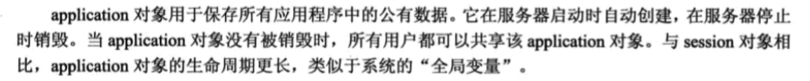
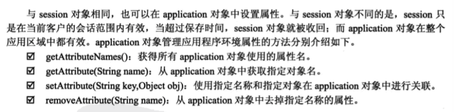

# application对象





### 访问应用程序初始化参数


1. 获取web.xml文件中配置的url参数的值

```
application.getInitParameter("url");


// 例子
Enumeration enumer = application.getInitParameterNames();
while(enumer.hasMoreElements()){
	String name = (String)enumer.nextElement();
	String value = application.getInitParameter(name);
	out.println(name+":");
	out.println(value);
}

```

2. 返回所有已定义的应用程序初始化参数名的枚举

```
application.getAttributeNames();

```

### 管理应用程序环境属性




