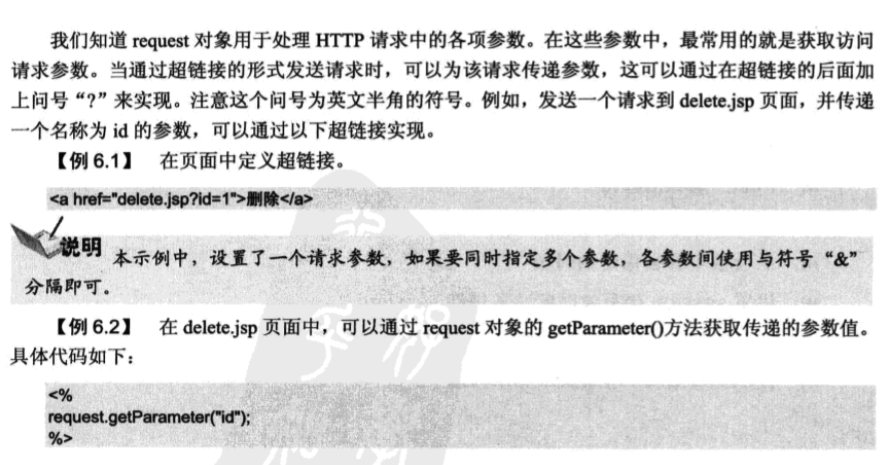
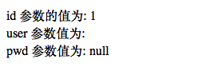
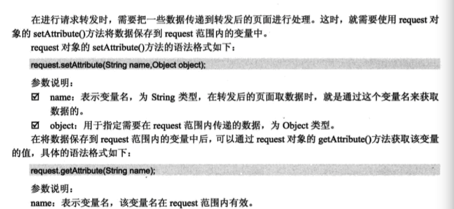
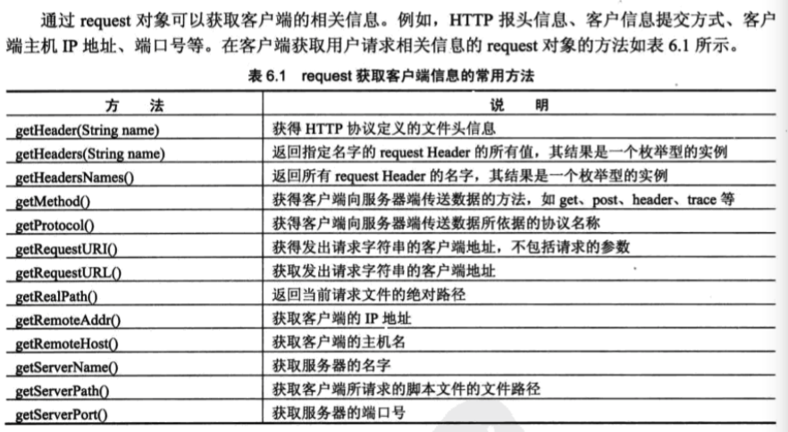
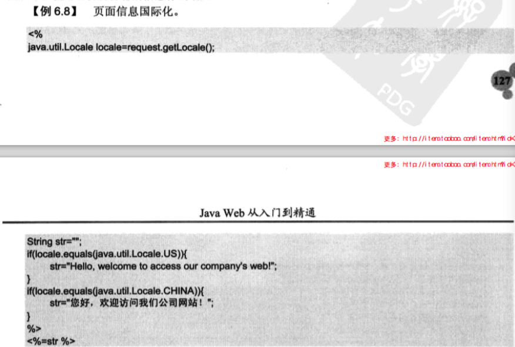

# request对象

###访问请求参数




index
```
<a href = "deal.jsp?id=1&user">处理页</a>
```

deal.jsp
```
<%@ page language="java" contentType="text/html; charset=UTF-8"
    pageEncoding="UTF-8"%>

    <%
    String id = request.getParameter("id");
    String user = request.getParameter("user");
    String pwd = request.getParameter("pwd");
    %>


<!DOCTYPE html PUBLIC "-//W3C//DTD HTML 4.01 Transitional//EN" "http://www.w3.org/TR/html4/loose.dtd">
<html>
<head>
<meta http-equiv="Content-Type" content="text/html; charset=UTF-8">
<title>Insert title here</title>
</head>
<body>

id 参数的值为: <%= id %><br>
user 参数值为: <%= user %> <br>
pwd 参数值为: <%= pwd %> <br>


</body>
</html>
```


result




### 在作用域中管理属性



###  获取cookie


### 解决中文乱码

```
<%=new String(request.getParameter("name").getBytes("ISO-8859-1"),"UTF-8") %>

```

### 获取客户信息





### 显示国际化信息




