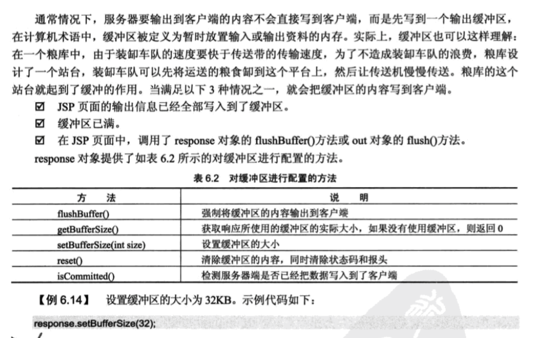

# response对象


### 重定向网页
```
response.sendRedirect(String path);

<body>
<%
response.sendRedirect("login.jsp");
%>
</body>

```

### 处理HTTP文件头


1. 禁用缓存
```
<%
response.setHeader("Cache-Control", "no-store");
response.setDateHeader("Expires", 0);
%>
```

2. 设置页面自动刷新
```
<%
response.setHeader("refresh", "10");
%>
```
3. 定时跳转网页
```
<%
response.setHeader("refresh", "5;URL=login.jsp");
%>

```

### 设置输出缓存




