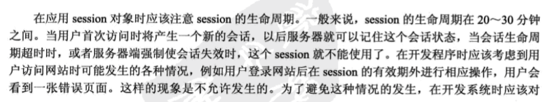
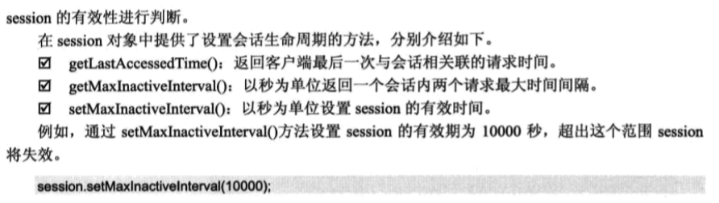

# session对象

### 创建及获取客户的会话
```
// set
session.setAttribute("username", "绿草");


// get
String user =(String)session.getAttribute("username");

String user =session.getAttribute("username").toString();

```
### 在会话中移动指定绑定对象
```
session.removeAttribute("username");
```

### 销毁session

```
session.invalidate();
```
session对象被销毁后将不能再调用session对象,如果在次调用session对象的任何方法,将会报出Session already invalidated 异常

### 会话超时的管理





### session对象的应用


