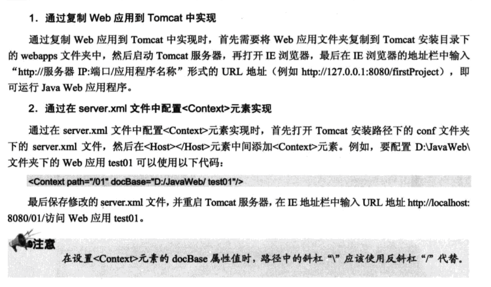

# Tomcat

###官网下载地址

http://tomcat.apache.org


### 安装

1. 将解压后的Apache Tomcat文件拷贝到任意的目录下：网上建议一般放在，服务器，数据库MySQL等均放在"/usr/local/“（可以右键单击Finder图标，前往文件夹，输入/usr/local即可）目录下面,重命名Tomcat 。

2. 修改目录权限
到终端输入
```
sudo chmod 755 /Users/`mac名`/Library//Tomcat/bin/*.sh
```
3. 启动
 按回车键之后会提示输入密码，请输入管理员密码。之后输入并回回车：
```
sudo sh startup.sh
```
若出现如下提示则表示安装并运行成功：
```
Using CATALINA_BASE: /Library/Tomcat
Using CATALINA_HOME: /Library/Tomcat
Using CATALINA_TMPDIR: /Library/Tomcat/temp
Using JRE_HOME: /System/Library/Frameworks/JavaVM.framework/Versions/CurrentJDK/Home
```
4.  打开浏览器，输入 http://localhost:8080/
回车之后如果看到Apache Tomcat，表示已经成功运行Tomcat


5. 配置Tomcat启动脚本：
使用文本编辑器添加以下代码：

```
#!/bin/bash

case $1 in
start)
sh /Library/Tomcat/bin/startup.sh
;;
stop)
sh /Library/Tomcat/bin/shutdown.sh
;;
restart)
sh /Library/Tomcat/bin/shutdown.sh
sh /Library/Tomcat/bin/startup.sh
;;
*)
echo “Usage: start|stop|restart”
;;
esac

exit 0
```
将文件保存为tomcat，小写并不带后缀。赋予文件执行权限：
```
chmod 777 tomcat
```
。将这个文件放置到终端包含的路径中，例如/usr/bin，而后便可以在终端中简单地输入tomcat start和tomcat stop启用tomcat了。

快捷命令如下：
```
1） tomcat start
2)  tomcat stop
3)  tomcat restart
```

### 修改默认端口


`注意:在修改端口时,应该避免与公用端口的冲突,建议采用默认的8080端口,不要修改,除非8080被其他程序所占用.`

修改过成功后重新启动Tomcat服务器
---
###部署Web应用

将开放完成的Java Web 应用部署到 Tomcat 中, 可以通过两种方法实现.




