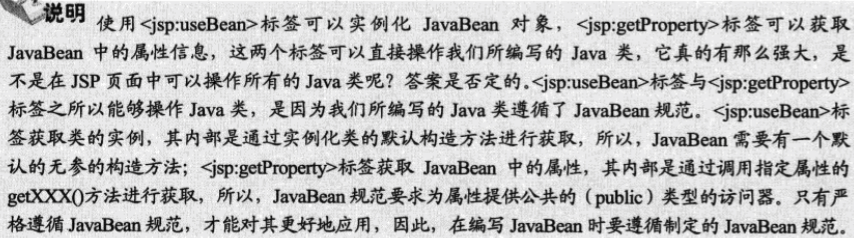

# b_javaBean应用

### 获取javabean属性信息

``` java
public class Produce {

	private String name = "电吉他";

	private double price = 1880.5;

	private int count = 100;

	private String factoryAdd = "吉林省";

	public String getName() {
		return name;
	}

	public double getPrice() {
		return price;
	}

	public int getCount() {
		return count;
	}

	public String getFactoryAdd() {
		return factoryAdd;
	}
}
```

``` html

<jsp:useBean id="produce1" class="com.lyq.bean.Produce"></jsp:useBean>

<div>
<ul>
<li>
商品名:<jsp:getProperty property = "name" name="produce1"/>
</li>
<li>
价格:<jsp:getProperty property = "price" name="produce1"/>
</li>
<li>
数量:<jsp:getProperty property = "count" name="produce1"/>
</li>
<li>
厂址:<jsp:getProperty property = "factoryAdd" name="produce1"/>
</li>

</ul>
</div>

```



### 对javaBean属性进行赋值
