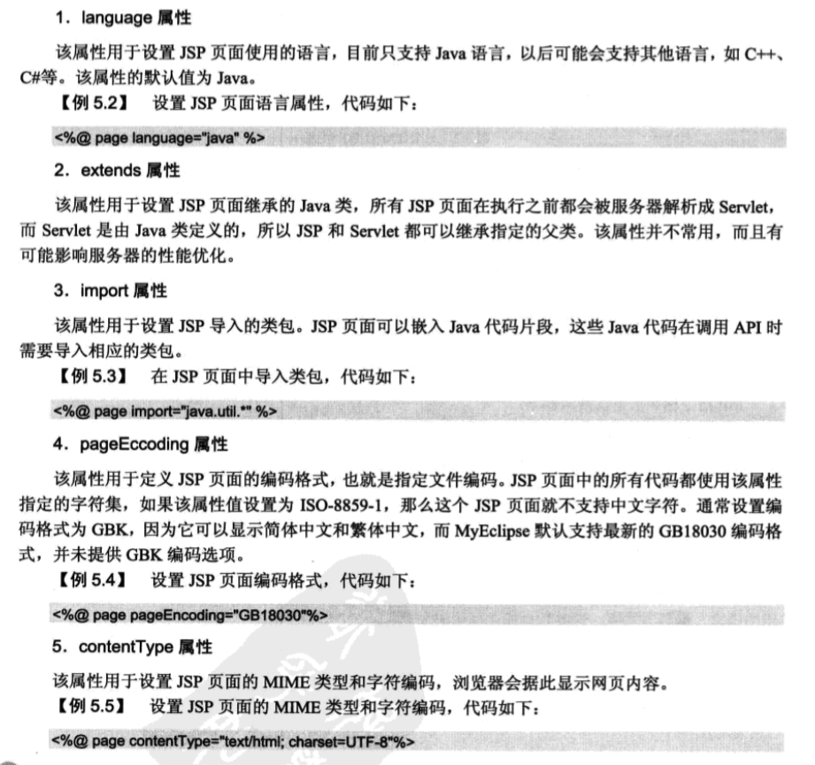
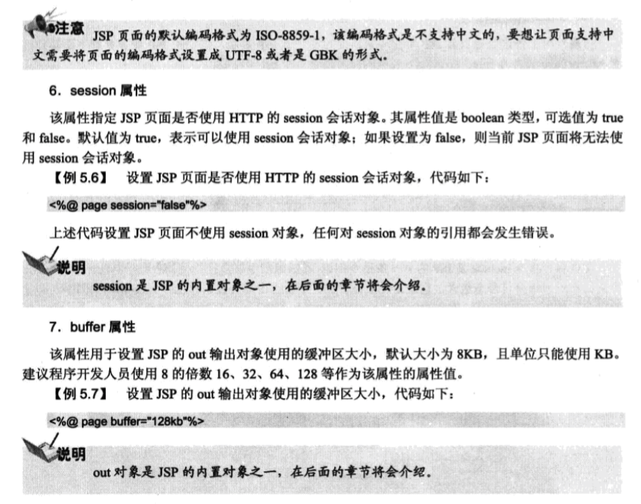
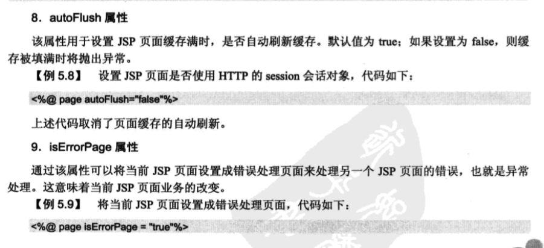
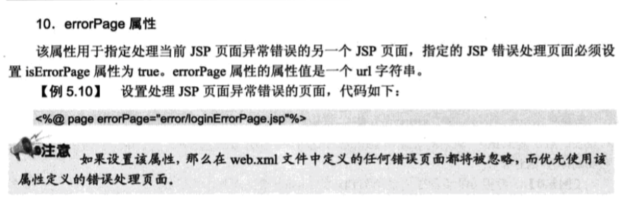
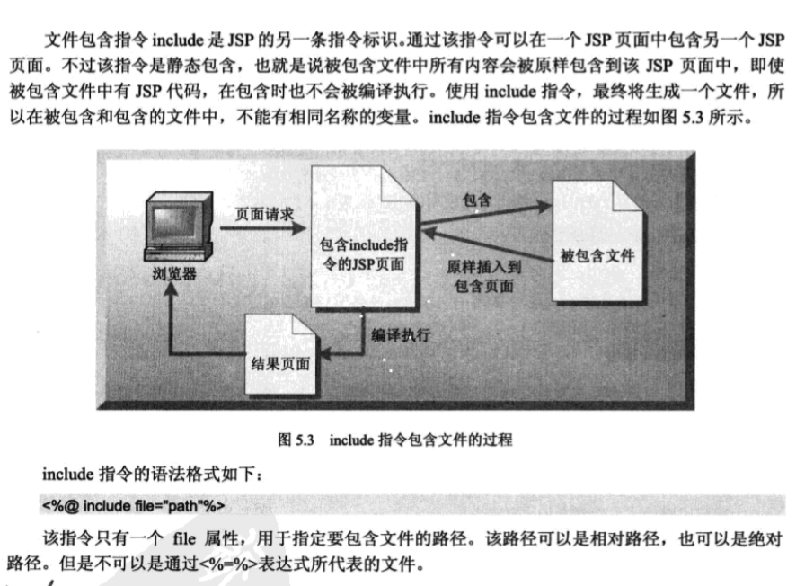
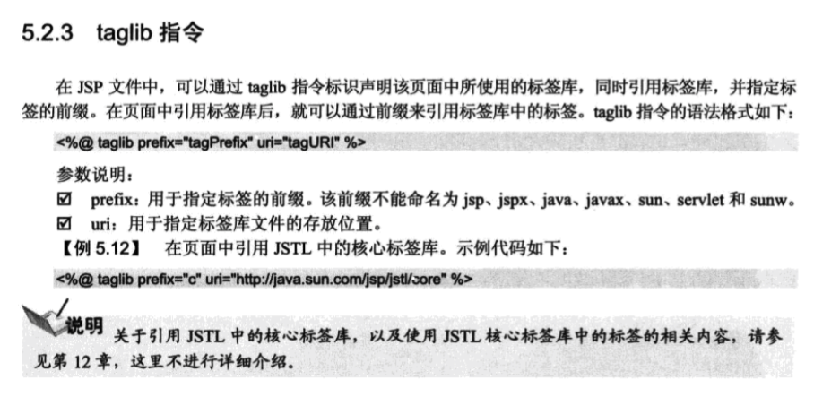

# lesson 指令标识
<%@ 指令名 属性 1="属性值1" 属性 2="属性值2"....%>

如
```
<%@ page language="java" contentType="text/html; charset=UTF-8"
    pageEncoding="UTF-8"%>
```

### page 指令
<%@ page attr1 = "value1" attr2 = "value2" ...%>
包含15个属性







### include 指令



```
<body style = "margin: 0px;">

<%@ include file = "top.jsp" %>

<table width = "781" height = "279" border = "1" cellspacing = "0" >
<tr>
<td>&nbsp;</td>
</tr>

<%@ include file ="copyright.jsp" %>

</table>
</body>
```


### taglib 指令



